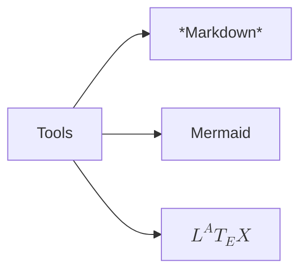

# Minding Daily

This is a **record** of my **_study_** life and my **_thoughts_**. I will record my daily in this **repository**.

## Tools

- **_Markdown_**: Record my daily.
- **Mermaid**: Draw my minding map during _studying_ and _thinking_.
- **$L^AT_EX$**: _Formulas_ renderer.

An example of using mermaid to draw a minding map:

## Record Language

The following languages will be used to record my daily, but I'll _only_ use **either of** them to record a daily.

- **_Chinese_**
- **_English_**

## What will be recorded.

- **Learning**
- **Reviews**
- **Reading**
- **Writing**
- **Coding**
- **_etc._**
